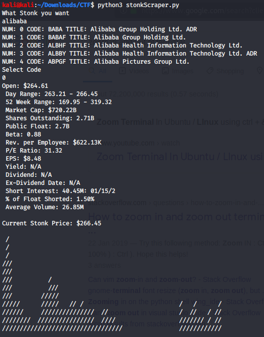
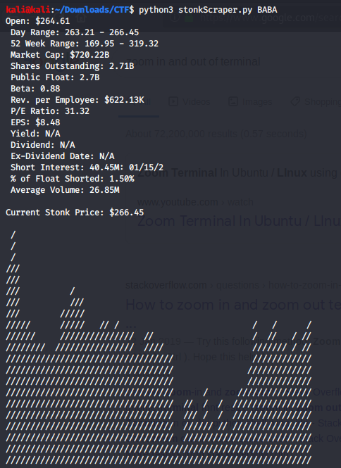
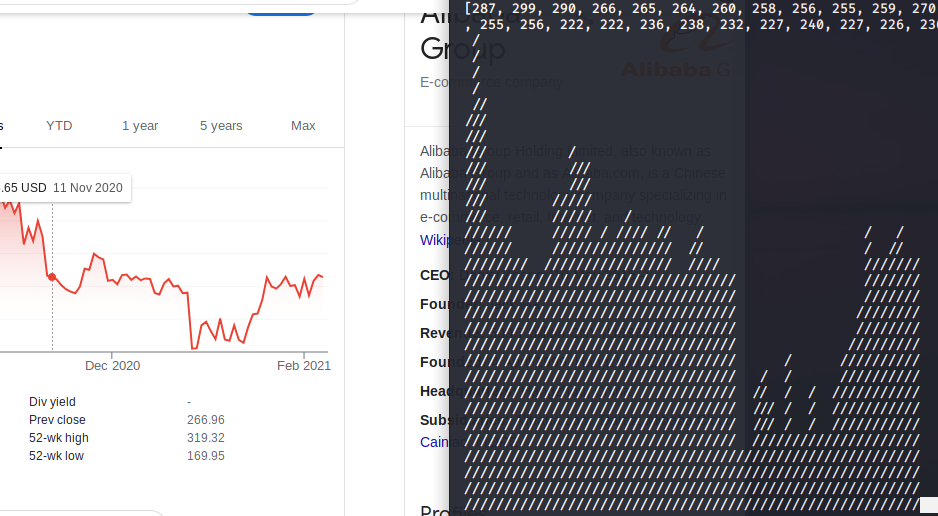

# StockScraper
A Python script that scrapes some stock market information on the stock of your choice from Market Watch. It will additionally print a graph of the current stock ticker from yahoo finance showing the past 62 days closing prices. The termplot.py file is imported into the stonkScraper.py file but no interaction with it needed.

# Installation
You can install the requirments.txt file with:
> pip3 install -r requirements.txt

# Features
The script can take input of an organisations name and offer possible stocks you meant if you don't know the code: 
> python3 stonkScraper.py




The script can take a direct stock code if known, such as:
> python3 stonkScraper.py BABA




```diff
- DISCLAIMER: THE GRAPH GENERATION CODE IS TAKEN AND MODIFIED FROM https://github.com/iswdp/termplot AND IS A CLOSE REPRESENTATION OF THE YAHOO TICKER 
```


